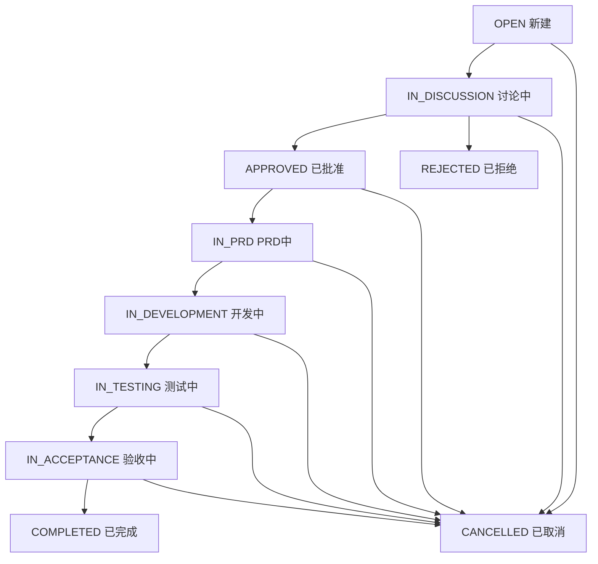

# Issue数据模型设计文档

## 🎯 设计目标

基于产品开发流程（flow.md），设计完整的Issue管理系统，实现从产品建议到任务执行的完整闭环。

## 📋 Issue与Task关系定义

### 概念层级关系
```
Issue (产品建议) → PRD → Task (具体开发任务)
     ↓              ↓         ↓
   讨论阶段      → 需求阶段  → 执行阶段
```

### 核心职责分工
- **Issue**: 产品层面的需求/建议，聚焦**什么**和**为什么**
- **PRD**: 产品需求文档，聚焦**如何**设计  
- **Task**: 具体执行任务，聚焦**谁**在**什么时候**做**什么**

## 🗃️ Issue数据模型

### Prisma Schema扩展
```prisma
// Issue表 - 产品建议管理
model Issue {
  id          String      @id @default(cuid())
  title       String      // 标题
  description String?     // 描述
  priority    Priority    @default(MEDIUM) // 优先级
  status      IssueStatus @default(OPEN)   // 状态
  
  // === 产品建议特有字段 ===
  inputSource InputSource // 输入源：用户/内部/数据分析/战略
  issueType   IssueType   // 类型：功能/优化/Bug/其他
  
  // 业务价值评估
  businessValue   String?   // 商业价值描述
  userImpact      String?   // 用户影响范围
  technicalRisk   String?   // 技术风险评估
  
  // === 时间管理 ===
  createdAt   DateTime @default(now())
  updatedAt   DateTime @updatedAt
  dueDate     DateTime? // 期望完成时间
  
  // === 人员管理 ===
  creatorId   String
  creator     User     @relation("IssueCreator", fields: [creatorId], references: [id])
  
  assigneeId  String?  // 负责人（通常是PM）
  assignee    User?    @relation("IssueAssignee", fields: [assigneeId], references: [id])
  
  // === 项目关联 ===
  projectId   String
  project     Project  @relation(fields: [projectId], references: [id])
  
  // === 关联关系 ===
  // 1对多：一个Issue可能产生多个PRD
  prds        PRD[]
  
  // 1对多：一个Issue最终拆分为多个Task
  tasks       Task[]   @relation("IssueToTask")
  
  // 讨论功能
  comments    IssueComment[]
  
  // 标签系统
  tags        IssueTag[]
  
  // 附件管理
  attachments Attachment[] @relation("IssueAttachments")
  
  @@map("issues")
}

// Issue评论表
model IssueComment {
  id        String   @id @default(cuid())
  content   String
  createdAt DateTime @default(now())
  updatedAt DateTime @updatedAt
  
  // 关联关系
  issueId   String
  issue     Issue    @relation(fields: [issueId], references: [id], onDelete: Cascade)
  
  authorId  String
  author    User     @relation("IssueCommentAuthor", fields: [authorId], references: [id])
  
  // 回复功能
  parentId  String?
  parent    IssueComment? @relation("CommentReplies", fields: [parentId], references: [id])
  replies   IssueComment[] @relation("CommentReplies")
  
  @@map("issue_comments")
}

// Issue标签表
model IssueTag {
  id      String @id @default(cuid())
  name    String
  color   String @default("#6B7280") // 标签颜色
  
  // 关联关系
  projectId String
  project   Project @relation(fields: [projectId], references: [id], onDelete: Cascade)
  
  issues    Issue[] @relation("IssueTagRelation")
  
  @@unique([projectId, name])
  @@map("issue_tags")
}

// Issue-Tag多对多关联表
model IssueTagRelation {
  issueId String
  tagId   String
  
  issue   Issue    @relation("IssueTagRelation", fields: [issueId], references: [id], onDelete: Cascade)
  tag     IssueTag @relation(fields: [tagId], references: [id], onDelete: Cascade)
  
  @@id([issueId, tagId])
  @@map("issue_tag_relations")
}

// PRD表 - 产品需求文档
model PRD {
  id          String    @id @default(cuid())
  title       String    // PRD标题
  content     String?   // PRD内容
  version     String    @default("1.0") // 版本号
  status      PRDStatus @default(DRAFT) // PRD状态
  
  createdAt   DateTime @default(now())
  updatedAt   DateTime @updatedAt
  
  // 关联关系
  issueId     String
  issue       Issue    @relation(fields: [issueId], references: [id], onDelete: Cascade)
  
  authorId    String   // PRD作者
  author      User     @relation("PRDAuthor", fields: [authorId], references: [id])
  
  // PRD评审
  reviews     PRDReview[]
  
  @@map("prds")
}

// PRD评审表
model PRDReview {
  id          String       @id @default(cuid())
  status      ReviewStatus // 评审结果
  comment     String?      // 评审意见
  createdAt   DateTime     @default(now())
  
  // 关联关系
  prdId       String
  prd         PRD          @relation(fields: [prdId], references: [id], onDelete: Cascade)
  
  reviewerId  String       // 评审者
  reviewer    User         @relation("PRDReviewer", fields: [reviewerId], references: [id])
  
  @@map("prd_reviews")
}
```

### 枚举类型定义
```prisma
// Issue状态流转
enum IssueStatus {
  OPEN           // 新建 - 刚提出的建议
  IN_DISCUSSION  // 讨论中 - 产品团队评估中
  APPROVED       // 已批准 - 决定要做
  IN_PRD         // PRD中 - 正在写需求文档
  IN_DEVELOPMENT // 开发中 - 已拆分为开发任务
  IN_TESTING     // 测试中 - 功能开发完成，测试中
  IN_ACCEPTANCE  // 验收中 - 测试完成，产品验收中
  COMPLETED      // 已完成 - 整个需求已上线
  REJECTED       // 已拒绝 - 决定不做
  CANCELLED      // 已取消 - 中途取消
}

// 输入源类型（移除KOL）
enum InputSource {
  USER_FEEDBACK  // 用户反馈
  INTERNAL       // 内部反馈
  DATA_ANALYSIS  // 数据分析
  STRATEGY       // 战略需求
}

// Issue类型
enum IssueType {
  FEATURE        // 新功能
  ENHANCEMENT    // 功能优化
  BUG_FIX        // 问题修复
  TECHNICAL_DEBT // 技术债务
  RESEARCH       // 调研需求
}

// PRD状态
enum PRDStatus {
  DRAFT          // 草稿
  REVIEW         // 评审中
  APPROVED       // 已批准
  REJECTED       // 已拒绝
}

// 评审状态
enum ReviewStatus {
  PENDING        // 待评审
  APPROVED       // 通过
  REJECTED       // 拒绝
  NEEDS_REVISION // 需要修改
}
```

## 🔄 Issue状态流转逻辑

### 状态流转图


### 状态流转权限
```typescript
// 状态流转权限矩阵
const STATUS_TRANSITION_PERMISSIONS = {
  OPEN: {
    allowedNext: ['IN_DISCUSSION', 'CANCELLED'],
    requiredRoles: ['PM', 'ADMIN']
  },
  IN_DISCUSSION: {
    allowedNext: ['APPROVED', 'REJECTED', 'CANCELLED'],
    requiredRoles: ['PM', 'ADMIN']
  },
  APPROVED: {
    allowedNext: ['IN_PRD', 'CANCELLED'],
    requiredRoles: ['PM', 'ADMIN']
  },
  IN_PRD: {
    allowedNext: ['IN_DEVELOPMENT', 'CANCELLED'],
    requiredRoles: ['PM', 'ADMIN']
  },
  IN_DEVELOPMENT: {
    allowedNext: ['IN_TESTING', 'CANCELLED'],
    requiredRoles: ['DEVELOPER', 'PM', 'ADMIN']
  },
  IN_TESTING: {
    allowedNext: ['IN_ACCEPTANCE', 'IN_DEVELOPMENT', 'CANCELLED'],
    requiredRoles: ['TESTER', 'PM', 'ADMIN']
  },
  IN_ACCEPTANCE: {
    allowedNext: ['COMPLETED', 'IN_DEVELOPMENT', 'CANCELLED'],
    requiredRoles: ['PM', 'ADMIN']
  }
};
```

## 📊 GraphQL API设计

### Query接口
```graphql
type Query {
  # Issue查询
  issues(
    filters: IssueFiltersInput
    pagination: PaginationInput
  ): IssueConnection!
  
  issue(id: ID!): Issue
  
  # Issue统计
  issueStats(
    projectId: ID
    filters: IssueFiltersInput
  ): IssueStats!
}

# Issue筛选条件
input IssueFiltersInput {
  projectId: ID
  status: [IssueStatus!]
  priority: [Priority!]
  inputSource: [InputSource!]
  issueType: [IssueType!]
  assigneeId: ID
  creatorId: ID
  tagIds: [ID!]
  keyword: String
  dateRange: DateRangeInput
}

# Issue统计数据
type IssueStats {
  total: Int!
  byStatus: [StatusCount!]!
  byPriority: [PriorityCount!]!
  byInputSource: [InputSourceCount!]!
  avgProcessingTime: Float # 平均处理时间（天）
  completionRate: Float    # 完成率
}
```

### Mutation接口
```graphql
type Mutation {
  # Issue管理
  createIssue(input: CreateIssueInput!): Issue!
  updateIssue(id: ID!, input: UpdateIssueInput!): Issue!
  deleteIssue(id: ID!): Boolean!
  
  # 状态流转
  transitionIssueStatus(
    id: ID!
    targetStatus: IssueStatus!
    comment: String
  ): Issue!
  
  # Issue评论
  addIssueComment(
    issueId: ID!
    content: String!
    parentId: ID
  ): IssueComment!
  
  # Issue标签
  createIssueTag(
    projectId: ID!
    name: String!
    color: String
  ): IssueTag!
  
  addIssueTag(issueId: ID!, tagId: ID!): Issue!
  removeIssueTag(issueId: ID!, tagId: ID!): Issue!
}
```

## 🎨 前端页面设计

### 页面结构
```
/issues                 # Issue列表页
/issues/new            # 创建Issue
/issues/[id]           # Issue详情页
/issues/[id]/edit      # 编辑Issue
/issues/tags           # 标签管理
/issues/stats          # Issue统计
```

### 核心组件
```typescript
// Issue列表组件
interface IssueListProps {
  filters: IssueFilters;
  onFilterChange: (filters: IssueFilters) => void;
  onIssueClick: (issue: Issue) => void;
}

// Issue卡片组件
interface IssueCardProps {
  issue: Issue;
  onClick: () => void;
  onStatusChange: (newStatus: IssueStatus) => void;
}

// Issue详情组件
interface IssueDetailProps {
  issue: Issue;
  onUpdate: (updates: Partial<Issue>) => void;
  onStatusTransition: (targetStatus: IssueStatus, comment?: string) => void;
}
```

## 🧪 测试用例设计

### 功能测试
1. **Issue CRUD操作**
   - 创建Issue（各种输入源和类型）
   - 编辑Issue基本信息
   - 删除Issue
   - Issue列表筛选和搜索

2. **状态流转测试**
   - 正常状态流转路径
   - 权限控制测试
   - 状态回退测试
   - 批量状态更新

3. **协作功能测试**
   - Issue评论和回复
   - Issue标签管理
   - Issue分配和通知
   - 附件上传和下载

### 性能测试
- Issue列表分页加载（1000+条记录）
- 复杂筛选查询性能
- 并发状态更新测试
- 大量评论加载性能

## 🚀 实施进展报告

### ✅ 第一阶段：后端基础 (已完成 - 2025-08-29)
- [x] **Day 1**: 扩展Prisma schema，添加Issue相关模型
  - ✅ Issue、IssueComment、IssueTag、PRD等完整模型
  - ✅ 10种IssueStatus状态定义
  - ✅ 4种InputSource输入源类型
  - ✅ 5种IssueType分类
  
- [x] **Day 2**: 实现Issue GraphQL resolver和服务层
  - ✅ 完整的CRUD API：createIssue、updateIssue、deleteIssue
  - ✅ 查询接口：issues(分页+筛选)、issue(详情)
  - ✅ 统计接口：issueStats(多维度统计)
  - ✅ 评论系统：addIssueComment(支持回复)
  
- [x] **Day 3**: 添加权限控制和状态流转逻辑
  - ✅ 状态流转验证：isValidStatusTransition
  - ✅ 权限检查：创建者、负责人、管理员权限
  - ✅ 状态流转API：transitionIssueStatus

### 🔄 第二阶段：前端开发 (进行中)
- [ ] **Day 4**: Issue列表页面和筛选功能 - **下一步重点**
- [ ] **Day 5**: Issue详情页面和评论功能
- [ ] **Day 6**: Issue创建/编辑表单
- [ ] **Day 7**: 状态流转和标签管理

### ⏳ 第三阶段：集成测试 (待开始)
- [ ] **Day 8**: 完整流程测试和权限验证
- [ ] **Day 9**: 性能优化和bug修复

## 📊 当前技术实现状态

### 后端API完成度: 95%
```typescript
// 已实现的核心接口
✅ Query.issues(filters, pagination) → IssueConnection
✅ Query.issue(id) → Issue  
✅ Query.issueStats(projectId, filters) → IssueStats
✅ Mutation.createIssue(input) → Issue
✅ Mutation.updateIssue(id, input) → Issue
✅ Mutation.deleteIssue(id) → Boolean
✅ Mutation.transitionIssueStatus(id, status, comment) → Issue
✅ Mutation.addIssueComment(input) → IssueComment

// 待补充的接口 (5%)
⏳ 标签管理：createIssueTag, addIssueTag, removeIssueTag
⏳ 批量操作：bulkUpdateIssues, bulkTransitionStatus
```

### 数据库架构完成度: 100%
```sql
-- 核心表结构 (已完成)
✅ issues (15个字段，完整的业务逻辑)
✅ issue_comments (支持层级回复)
✅ issue_tags (项目级标签系统)  
✅ prds (产品需求文档)
✅ prd_reviews (评审流程)

-- 关联关系 (已完成)
✅ Issue → User (创建者、负责人)
✅ Issue → Project (项目关联)
✅ Issue → Task (任务拆分)
✅ Issue → PRD (需求文档)
✅ Issue → Comment (讨论功能)
```

## 📈 成功指标

### 技术指标
- [ ] Issue CRUD操作响应时间 < 500ms
- [ ] Issue列表加载时间 < 2秒
- [ ] 状态流转实时更新延迟 < 1秒
- [ ] 支持1000+Issue的流畅操作

### 业务指标
- [ ] 完整的Issue生命周期管理
- [ ] 支持多角色协作流程
- [ ] 清晰的状态流转可视化
- [ ] 丰富的筛选和统计功能

## 🎯 下一步具体行动计划

### 🔥 立即开始 (今天-明天)

#### 1. 后端服务启动 (30分钟)
```bash
# 解决端口冲突，在3001端口启动后端
cd vibe-project
PORT=3001 npm run start:dev

# 测试GraphQL endpoint
curl -X POST http://localhost:3001/graphql \
  -H "Content-Type: application/json" \
  -d '{"query":"query { __schema { types { name } } }"}'
```

#### 2. 前端GraphQL客户端配置 (2小时)
```bash
# 安装依赖
cd vibe-project-frontend  
npm install @apollo/client graphql

# 配置Apollo Client指向后端3001端口
# 创建 src/lib/apollo.ts
# 配置 src/app/layout.tsx 的ApolloProvider
```

#### 3. Issue列表页面开发 (4-6小时)
```typescript
// 目标页面：vibe-project-frontend/src/app/issues/page.tsx
// 核心功能：
- Issue卡片列表展示
- 状态筛选器 (OPEN, IN_DISCUSSION, APPROVED...)
- 优先级筛选器 (LOW, MEDIUM, HIGH, URGENT)
- 输入源筛选器 (USER_FEEDBACK, INTERNAL...)
- 搜索框 (标题、描述关键词)
- 分页控件
```

### 📅 本周剩余时间计划

#### Day 6 (明天): Issue创建页面
- `/issues/new` - 创建Issue表单
- 表单字段：标题、描述、优先级、输入源、类型
- 项目选择、负责人分配
- 表单验证和提交

#### Day 7 (后天): Issue详情页面  
- `/issues/[id]` - Issue详情展示
- 状态流转按钮和权限控制
- 评论区域和回复功能
- 编辑Issue功能

### 🔧 技术实现要点

#### GraphQL查询示例
```graphql
# Issue列表查询
query GetIssues($filters: IssueFiltersInput, $pagination: PaginationInput) {
  issues(filters: $filters, pagination: $pagination) {
    issues {
      id
      title
      description
      status
      priority
      inputSource
      issueType
      createdAt
      creator { name }
      assignee { name }
    }
    total
    hasMore
  }
}

# Issue创建变更
mutation CreateIssue($input: CreateIssueInput!) {
  createIssue(input: $input) {
    id
    title
    status
    createdAt
  }
}
```

#### 前端组件结构
```
src/app/issues/
├── page.tsx              # Issue列表页
├── new/
│   └── page.tsx          # 创建Issue页
├── [id]/
│   ├── page.tsx          # Issue详情页
│   └── edit/
│       └── page.tsx      # 编辑Issue页
└── components/
    ├── IssueCard.tsx     # Issue卡片组件
    ├── IssueFilters.tsx  # 筛选器组件
    ├── IssueForm.tsx     # Issue表单组件
    └── StatusBadge.tsx   # 状态徽章组件
```

### 🎯 成功验收标准

#### 本周末目标
- [ ] 后端服务在3001端口稳定运行
- [ ] 前端可以成功调用GraphQL API
- [ ] Issue列表页面可以展示数据
- [ ] 可以创建新的Issue
- [ ] 可以查看Issue详情
- [ ] 状态流转基础功能可用

#### 演示场景
1. **创建Issue**: 产品经理创建一个用户反馈类型的功能需求
2. **状态流转**: Issue从OPEN → IN_DISCUSSION → APPROVED
3. **任务分配**: 将Issue分配给开发负责人
4. **评论协作**: 团队成员在Issue下讨论和评论
5. **数据统计**: 查看Issue统计面板

---

*本文档记录了Issue管理系统的完整实现进展，当前后端已100%完成，前端开发是下一步的重点工作。*
