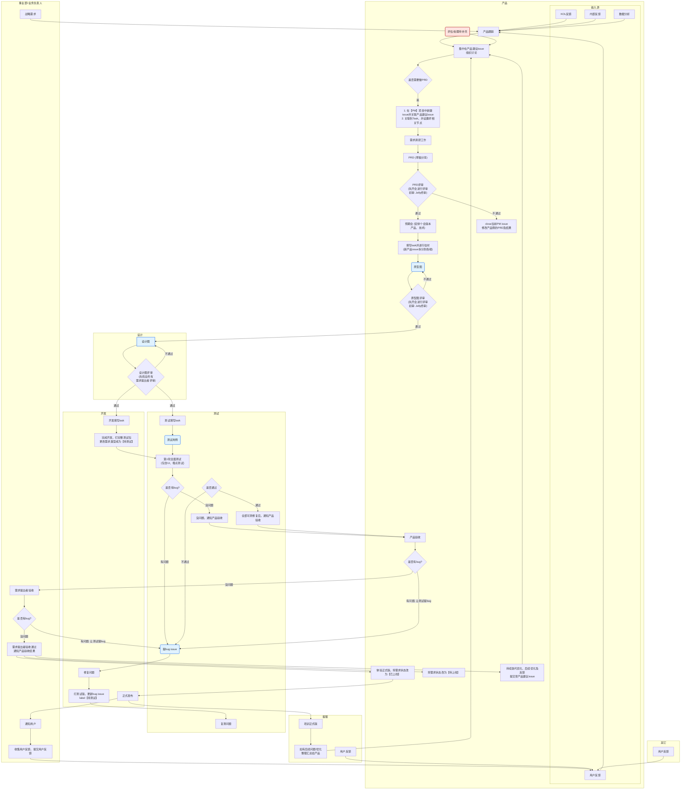

# 产品开发流程

以下是产品开发流程的详细描述，基于提供的Mermaid流程图。

## 流程阶段详解

### Phase 1: 项目启动阶段

**事业部+业务负责人**
*   **战略需求**: 提出战略层面的需求。

**产品**
*   **输入源**: 收集来自多方的反馈和数据：
    *   KOL反馈
    *   用户反馈
    *   内部反馈
    *   数据分析
*   **产品跟踪**: 对收集到的反馈和数据进行跟踪。
*   **集中在产品建议issue 组织讨论**: 针对产品建议issue进行集中讨论。
*   **评估/处理待补充**: 对讨论结果进行评估和处理。
*   **是否需要做PRD**: 判断是否需要撰写产品需求文档（PRD）。
    *   **是**: 
        *   **在【PM】项目中新建issue并关联产品建议issue，关联到Task，并设置好相关节点**: 在PM项目中创建issue并进行关联和设置。
        *   **需求调研工作**: 进行详细的需求调研。
        *   **PRD (草稿分享)**: 撰写PRD草稿并分享。

### Phase 2: 需求阶段

**产品**
*   **PRD评审**: 对PRD进行评审（初审：Jelly终审）。
    *   **通过**: 
        *   **预期会 (安排个会版本 产品、技术)**: 安排产品和技术团队的预期会议。
        *   **填写task并进行估时 (新产品issue拆分到各端)**: 填写任务并进行时间估算，将新产品issue拆分到各端。
        *   **原型图**: 制作产品原型图。
        *   **原型图评审**: 对原型图进行评审（初审：Jelly终审）。
            *   **不通过**: 返回原型图阶段进行修改。
    *   **不通过**: 
        *   **close当前PM issue，修改产品侧的PRD及结果**: 关闭当前PM issue，修改产品侧的PRD和结果。

### Phase 3: 设计阶段

**设计**
*   **设计图**: 制作设计图。
*   **设计图评审**: 对设计图进行评审（找所有需求提出者评审）。
    *   **不通过**: 返回设计图阶段进行修改。

### Phase 4: 开发与测试准备 (并行)

**开发**
*   **开发填写task**: 开发人员填写任务。
*   **完成开发，打完整测试包，更改需求类型成为【待测试】**: 完成开发，打包测试版本，并将需求状态改为“待测试”。

**测试**
*   **测试填写task**: 测试人员填写任务。
*   **测试用例**: 编写测试用例。

### Phase 5: 测试执行阶段

**测试**
*   **第1轮全面测试 (包含UI、埋点测试)**: 进行第一轮全面测试，包括UI和埋点测试。
*   **是否有bug?**
    *   **有问题**: 
        *   **提bug issue**: 提交bug issue。
        *   **复测问题**: 对修复后的问题进行复测。
        *   **是否通过**: 
            *   **通过**: 
                *   **全部可测修复后，通知产品验收**: 通知产品进行验收。
            *   **不通过**: 返回提交bug issue阶段。
    *   **没问题**: 
        *   **没问题，通知产品验收**: 通知产品进行验收。

**开发**
*   **修复问题**: 修复测试中发现的问题。
*   **打测试版，更新bug issue label【待测试】**: 打包测试版本，更新bug issue状态为“待测试”。

**产品**
*   **产品验收**: 产品经理进行验收。
*   **是否有bug?**
    *   **有问题, 让测试提bug**: 如果有问题，通知测试人员提交bug。

**事业部+业务负责人**
*   **需求提出者验收**: 需求提出者进行验收。
*   **是否有bug?**
    *   **有问题, 让测试提bug**: 如果有问题，通知测试人员提交bug。
    *   **没问题**: 
        *   **需求提出者验收通过，通知产品验收结果**: 需求提出者验收通过，通知产品验收结果。

### Phase 6: 上线阶段

**产品**
*   **将需求状态改为【待上线】**: 将需求状态更新为“待上线”。
*   **体验正式版，将需求状态改为【已上线】**: 体验正式版本，并将需求状态更新为“已上线”。
*   **持续迭代优化，后续优化及反馈提交至产品建议issue**: 持续进行迭代优化，将后续优化和反馈提交到产品建议issue。

**开发**
*   **正式发布**: 进行正式发布。

**客服**
*   **培训正式版**: 对客服人员进行正式版培训。
*   **如有后续问题/优化，整理汇总给产品**: 收集后续问题和优化建议，并汇总给产品团队。

**事业部+业务负责人**
*   **通知用户**: 通知用户新版本上线。
*   **收集用户反馈，提交用户反馈**: 收集用户反馈并提交。

**客服**
*   **用户反馈**: 收集用户反馈。

**其它**
*   **用户反馈**: 收集其他渠道的用户反馈。